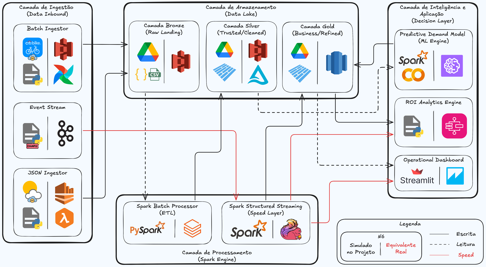

# Relatório Técnico - AV1

O projeto adota o paradigma da Arquitetura Lambda Híbrida combinada com a Arquitetura Medallion (Bronze, Silver, Gold), com o objetivo de suportar tanto o processamento massivo de dados históricos (Batch Layer) quanto a emulação de fluxos em tempo real (Speed Layer) para alertas logísticos.

Atualmente, o sistema opera em um ambiente simulado (Local/Virtual Environment), escolhida para evitar custos de nuvem durante o desenvolvimento, utilizando o sistema de arquivos local como Mock Data Lake e a memória da máquina para o processamento distribuído via PySpark. Embora execute localmente, toda a base de código (ex: uso do formato Parquet e transações ACID com Delta Lake) é 100% Cloud-Ready, podendo ser migrada para um cluster real sem alterações no core da engenharia.

## Diagrama de Arquitetura

O fluxo implementado nos módulos (notebooks localizados na pasta `/dados`) engloba Ingestão, Armazenamento e Transformação, mapeado da seguinte forma:

#### 1. Camada de Ingestão (Data Inbound)
Esta camada é responsável por capturar os dados do mundo exterior e trazê-los para o sistema.
* **1.1 Batch Ingestor:** Responsável por capturar dados históricos pesados (viagens).
* **1.2 Event Stream:** Responsável por capturar o fluxo de viagens acontecendo em tempo real.
* **1.3 JSON Ingestor:** Responsável por capturar dados de contexto em formato JSON (Clima, Feriados).

#### 2. Camada de Armazenamento (Data Lake / Medallion)
Onde os dados descansam em diferentes níveis de qualidade.
* **2.1 Camada Bronze (Raw Landing):** Onde o dado chega bruto, do jeito que foi extraído.
* **2.2 Camada Silver (Trusted/Cleared):** Onde o dado já foi limpo, filtrado e padronizado.
* **2.3 Camada Gold (Business/Refined):** Onde o dado está agregado e pronto para gerar valor financeiro.

#### 3. Camada de Processamento (Spark Engine)
O "músculo" da operação, responsável por transformar os dados entre as camadas do Data Lake.
* **3.1 Spark Batch Processor (ETL):** Lê grandes volumes de uma vez, limpa e salva.
* **3.2 Spark Structured Streaming (Speed Layer):** Fica "escutando" eventos em tempo real sem parar.

#### 4. Camada de Inteligência e Aplicação (Decision Layer)
A ponta final, que os diretores e a operação da empresa vão enxergar.
* **4.1 Predictive Demand Model (ML Engine):** O algoritmo de Inteligência Artificial.
* **4.2 ROI Analytics Engine:** O motor que traduz a logística em dinheiro (lucro/prejuízo).
* **4.3 Operational Dashboard:** A tela visual para os operadores de rua.

### O Fluxo dos Dados

**A Trilha Histórica (Batch):**
1. O **Batch Ingestor (1.1)** e o **JSON Ingestor (1.3)** descarregam os dados brutos na **Camada Bronze (2.1)**.
2. O **Spark Batch (3.1)** lê da Bronze (2.1), processa a sujeira e salva na **Camada Silver (2.2)**.
3. O **Modelo Preditivo de ML (4.1)** consome os dados limpos da Silver (2.2) para aprender os padrões e salva suas previsões na **Camada Gold (2.3)**.

**A Trilha de Tempo Real (Speed):**
1. O **Event Stream (1.2)** capta os aluguéis ao vivo e manda direto para o **Spark Streaming (3.2)**.
2. O Spark Streaming faz três coisas simultâneas com esse dado ao vivo:
	- Salva um registro na **Camada Gold (2.3)**.
	- Envia o dado para o **Motor de ROI (4.2)** calcular os custos no momento.
	- Dispara um alerta na tela do **Dashboard (4.3)**.

**A Visualização Final:**
O **Dashboard (4.3)** e o **Motor de ROI (4.2)** ficam lendo as tabelas refinadas da **Camada Gold (2.3)** para exibir os gráficos finais.

### Tecnologias utilizadas e Planejamento

A stack tecnológica foi selecionada para garantir viabilidade de execução local, espelhando os padrões da indústria. Abaixo, detalhamos a tecnologia atual e como ela seria substituída em um cenário corporativo com orçamento:

| Etapa do Pipeline | Tecnologia Utilizada (Projeto) | lternativa Enterprise (Cenário Real/Pago) | Justificativa da Escolha / Refinamento
| --- | --- | --- | --- |
| Armazenamento | File System Local (.venv) | Amazon S3 ou GCP Cloud Storage | O disco local simula a latência de um bucket de Object Storage; no cenário real, o S3 traria alta disponibilidade e escalabilidade infinita.
Orquestração | Execução manual/linear | Apache Airflow ou AWS Step Functions | Scripts Python executam a esteira, assim como o Airflow seria ideal no cenário real para gerenciar dependências, falhas e agendar as coletas (DAGs).
Processamento Batch | PySpark Local | Databricks ou AWS EMR | O Spark local foi mantido pela padronização do código. O Databricks abstrairia a infraestrutura e forneceria clusters elásticos (auto-scaling) para lidar com picos.
Formato de Dados | Parquet e Delta Lake | Delta Lake (Enterprise Databricks) | Preferiu-se por usar Delta Lake open-source localmente para garantir transações ACID, que é a mesma do cenário real.
Streaming Engine | Script Python (yield JSON) | Kafka ou Amazon Kinesis | Criação de um simulador para emular a pressão da rede de bikes; no mundo real, o Kafka reteria os eventos dos totens com tolerância a falhas.

## Arquitetura Implementada

A arquitetura encontra-se parcialmente implementada por dois motivos principais: primeiro, porque atualmente está sendo executado em um ambiente simulado e não numa infraestrutura de nuvem (Cloud) real; segundo, porque apenas a fundação de Engenharia de Dados foi construída até agora, estando a camada de Inteligência e Negócio reservada para a próxima fase (AV2).

Vejamos em detalhe como esta implementação parcial está estruturada atualmente:

### 1. O Ambiente Simulado (Infraestrutura Mock)
Para evitar os custos associados a serviços de nuvem (como a AWS ou Azure) durante esta fase inicial, a arquitetura foi desenhada para operar localmente, mas mantendo código com padrão de mercado (Cloud-Ready):
- Data Lake Simulado
- Motor de Processamento Local
- Simulador de Streaming

### 2. A Arquitetura Medallion Implementada (A Base de Dados)
Até ao momento, a equipe conseguiu implementar na íntegra a arquitetura Medallion, garantindo que os dados fluam pelas três camadas de qualidade:
- Camada Bronze: O Notebook 01 (`/notebooks/01_batch_ingestion.ipynb`) vai buscar gigabytes de dados históricos de viagens (CSV) e de APIs externas (Clima e Estações em JSON), guardando tudo no formato Parquet de forma imutável.
- Camada Silver: O Notebook 03 (`/notebooks/03_silver_layer.ipynb`) processa a camada Bronze, remove duplicados, calcula distâncias (fórmula de Haversine) e faz o cruzamento com o clima. Aqui, introduziu-se o armazenamento em o Delta Lake, que garante que os dados não se corrompem caso o processo falhe a meio (transações ACID).
- Camada Gold: Os Notebooks 04 (`/notebooks/04_gold_layer.ipynb`) e 05 (`/notebooks/05_pyspark_pipeline.ipynb`) criam a camada de alto valor, onde os dados da Silver são transformados num Modelo Estrela (para relatórios de Business Intelligence) e fatiados em janelas temporais contínuas de 15 e 30 minutos (preparando o terreno para o Machine Learning).

### 3. O Que Falta para a Implementação Total?
A arquitetura é considerada "parcial" porque a ponta final do pipeline ainda não foi construída, faltando implementar:
- O Consumidor de Streaming (Spark Structured Streaming): O processo que vai ficar ativamente à escuta dos ficheiros JSON gerados pelo vosso simulador.
- Modelagem Preditiva (ML Engine): O algoritmo de Machine Learning que vai consumir as janelas de 15/30 minutos da camada Gold para prever a rutura de stock das estações (Notebook 06).
- Motor de ROI e Dashboard: A interface visual e matemática que vai traduzir os acertos logísticos em métricas de poupança financeira (Notebook 07).

Em suma, os componentes mais centrais de extração, limpeza e armazenamento distribuído de Big Data já estão implementados e funcionais.

## Equipe e Divisão de Tarefas

A equipe foi organizada seguindo o a lógica de Pair Programming, em que cada par de integrantes foca em uma especialidade do pipeline para garantir profundidade técnica. Assim, as frentes de trabalho foram divididas da seguinte forma:

1. Frente de Ingestão e Simulação de Eventos
- Ingestão de Dados e Fontes externas: Responsável por coletar os dados históricos do Citi Bike e ingerir fontes secundárias (clima/feriados) para enriquecer o modelo de demanda
- Streaming e Simulador de Eventos: Responsável pela criação do simulador em Python que envia dados de viagens (origem/destino) em tempo real, simulando a "pressão" logística que o sistema sofre ao longo do dia.

2. Frente de Engenharia de Dados e Arquitetura
- Arquitetura Medallion e Armazenamento: Responsável pela implementação das camadas Bronze, Silver e Gold, garantindo que os dados transformados sejam salvos de forma eficiente (Parquet/Delta) para consumo rápido.
- Pipeline PySpark: Responsável pelo desenvolvimento das transformações críticas utilizando PySpark, focando em agregar a demanda por estação e calcular janelas de tempo de 15 a 30 minutos.

3. Frente de Inteligência Logística e Modelagem
- Modelo Preditivo de Demanda: Responsável pelo desenvolvimento do modelo preditivo que antecipa o esvaziamento ou lotação das estações, com meta de gerar o "alerta de rebalanceamento" antes que a crise logística ocorra, maximizando a ocupação.

4. Frente de Economia Empresarial e Visualização
- Business Case e Dashboard ROI: Responsável por traduzir a acurácia do modelo em termos monetários, e pela criação do dashboard que mostra quanto a empresa economiza ao reduzir caminhões de rebalanceamento e quanto ganha ao não ter estações vazias em horários de pico. Dessa forma, criará os KPIs de Eficiência Logística e ROI:
	- Taxa de Ruptura de Estoque (Stock-out Rate): Percentual de tempo em que uma estação fica com 0 bicicletas disponíveis em horários de pico. O modelo visa reduzir esse KPI para maximizar a conversão de aluguéis.
	- Custo de Rebalanceamento por Viagem: Valor estimado gasto para mover bicicletas via caminhões entre estações. O objetivo é diminuir esse custo através da predição, movendo as bikes apenas quando estritamente necessário.
	- Receita Potencial Recuperada: Cálculo de quantas viagens deixaram de ser perdidas devido à disponibilidade garantida pelo modelo preditivo.
	- Índice de Rotatividade do Ativo: Quantas vezes cada bicicleta é utilizada por dia. Estações otimizadas aumentam esse giro, melhorando o ROI sobre a frota imobilizada.

5. Frente de Governança, Arquitetura e QA
- Tech Lead e Documentação: Responsável pelo Diagrama de Arquitetura, supervisão e integração das frentes de desenvolvimento, elaboração de documentações e pelo mapeamento de requisitos.

### Funções

| Frente | Integrante(s) |
| -------- | -------- |
| Ingestão e Simulação de Eventos | João Henrique Lafetá *(jhml@cesar.school)* e Henrique Roma *(hrm@cesar.school)* |
| Engenharia de Dados e Arquitetura | Diego Arruda *(dca2@cesar.school)* e Rodrigo Dubeux *(rdmo@cesar.school)* |
| Inteligência Logística e Modelagem | Caio Barreto *(cba2@cesar.school)* |
| Economia Empresarial e Visualização | Victor Hora *(vht@cesar.school)* |
| Governança, Arquitetura e QA | Ana Beatriz Alves *(abxa@cesar.school)* |

> OBS: Dado a dependências da finalização da parte inicial, além do planejamento da disciplina somente prever certas atividades e entregas para a AV2, os membros das frentes não implementadas ficaram responsáveis pela consolidação da arquitetura, documentação de processos, estudo de ferramentas e planejamento da execução das próximas etapas.

## Checklist AV1

| Etapa | Status |
| -------- | -------- |
| Ingestão | ✅ Finalizado |
| Armazenamento | ⚠️ Finalizado |
| Transformação | ✅ Finalizado |